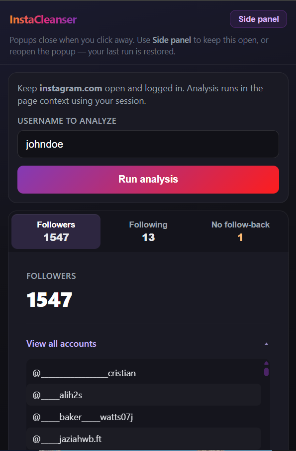
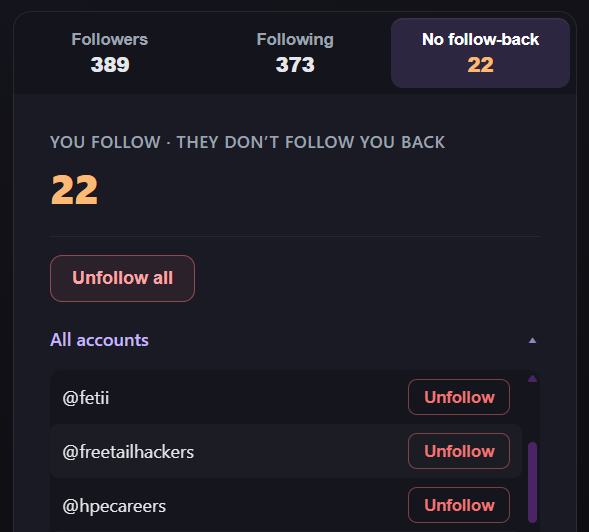

# InstaCleanser

Chrome extension that compares your Instagram followers and following **in your browser** (same cookies as a normal instagram.com tab), lists people you follow who do not follow you back, and lets you unfollow individually or in bulk when you are viewing **your own** profile. 

**Note: This is a heavily vibe-coded project that I did for fun after realizing the instaloader api method I was using before in a smaller python version of this was not going to cut it.**

## Screenshots

### Main view (Followers / Following)

The main UI after a run: stats, **Followers** / **Following** / **Don’t follow back** tabs, and scrollable lists. The **Followers** tab is shown here; the **Following** tab uses the same list layout.

### Don’t follow back (unfollow)

On **your own** profile, the **Don’t follow back** tab lists accounts you follow that do not follow you back. You can **Unfollow** one at a time or use **Unfollow all**.

If you analyze **someone else’s** username, those unfollow actions are **disabled** (read-only lists) so you cannot unfollow from another person’s profile.

## Requirements

- Google Chrome or Microsoft Edge (Chromium), **114+** (for the optional side panel).
- Stay logged in on [instagram.com](https://www.instagram.com) in the tab you use for analysis.

## Install (developer / unpacked)

1. Clone or download this repository.
2. Open `chrome://extensions` (Chrome) or `edge://extensions` (Edge).
3. Enable **Developer mode**.
4. Click **Load unpacked** and choose this folder (the repo root — the one that contains `manifest.json`).

## Usage

1. Open Instagram in a normal tab and log in.
2. Click the InstaCleanser toolbar icon.
3. Enter a **username to analyze** (yours or someone else’s). For unfollow actions, the username must be **yours**; for other profiles, lists are read-only.
4. Click **Run analysis**. Large accounts take a while.
5. Use **Side panel** to dock the UI so it stays open while you switch tabs; the toolbar popup closes automatically when you open the side panel.

Data from the last successful run is stored locally in `chrome.storage` and restored when you reopen the popup or side panel.

## Permissions

- **instagram.com** — run fetches in the page context with your session.
- **activeTab**, **scripting** — inject analysis/unfollow on the active Instagram tab.
- **storage** — cache last run and UI state.
- **sidePanel** — optional docked panel.

## Disclaimer

Instagram does not offer a public API for this workflow. The extension uses the same undocumented endpoints the website uses; behavior may change. Use unfollow features responsibly and at your own risk.
**Instagram does limit unfollow requests.** If you are hit with a 400 error, just wait some time.

## License

See [LICENSE](LICENSE).
