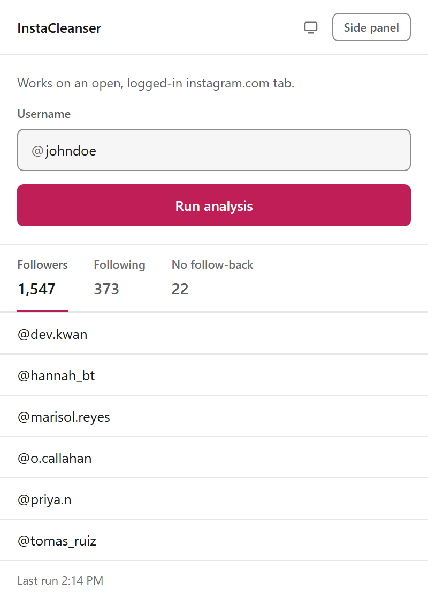
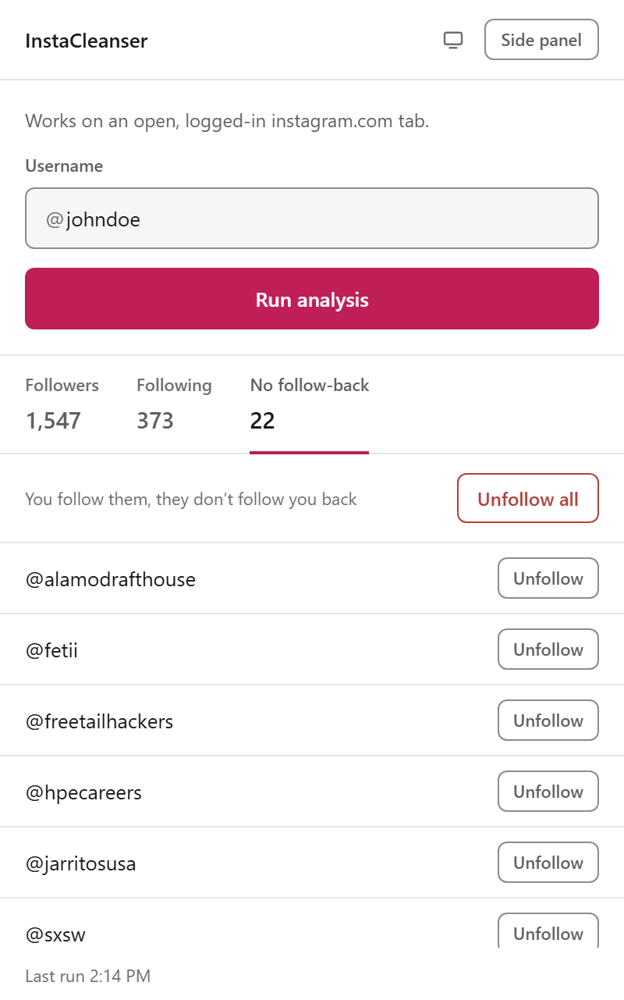

# InstaCleanser

A Chrome extension that compares your Instagram followers and following using the tab you are already logged into, shows who does not follow you back, and unfollows them one at a time or in bulk.

Everything runs in your own browser session, with the same cookies as a normal instagram.com tab. There is no backend, no InstaCleanser account, and no third-party login.

[Install from the Chrome Web Store](https://chromewebstore.google.com/detail/ecphalengelfdcnhallaepjbjgbcbnbb) · [Website](https://troydavis.me/instacleanser/) · [Privacy policy](https://troydavis.me/instacleanser/privacy.html)

> A heavily vibe-coded project I built for fun, after the Instaloader-based Python version I had before turned out not to cut it.

## Screenshots

<table>
<tr>
<td width="50%" valign="top">
<picture>
  <source media="(prefers-color-scheme: dark)" srcset="assets/popup-main-dark.png">
  
</picture>
</td>
<td width="50%" valign="top">
<picture>
  <source media="(prefers-color-scheme: dark)" srcset="assets/popup-nonfb-dark.png">
  
</picture>
</td>
</tr>
<tr>
<td valign="top">After a run, counts sit in the tab strip and the list starts directly below it. Followers and Following share the same layout.</td>
<td valign="top">On your own profile, No follow-back lists accounts you follow that do not follow back. Unfollow one at a time, or use <strong>Unfollow all</strong>.</td>
</tr>
</table>

Both surfaces follow your system light or dark setting, and carry a toggle if you want to override it. These images are rendered from the extension's own `popup.html`, `popup.css`, and `popup.js` with placeholder account data.

## Requirements

- Chrome or Edge on Chromium. Version 114 or later if you want the side panel.
- A logged-in [instagram.com](https://www.instagram.com) tab, open while you run an analysis.

## Install

**From the Chrome Web Store:** [InstaCleanser](https://chromewebstore.google.com/detail/ecphalengelfdcnhallaepjbjgbcbnbb). Updates arrive automatically.

**As an unpacked developer build:**

1. Clone or download this repository.
2. Open `chrome://extensions`, or `edge://extensions` on Edge.
3. Turn on **Developer mode**.
4. Choose **Load unpacked** and pick the repo root, the folder holding `manifest.json`.

After changing any file, use the reload button on the extension's card, then close and reopen the popup.

## Usage

1. Open Instagram in a normal tab and log in.
2. Click the InstaCleanser toolbar icon.
3. Enter a username. It can be yours or someone else's.
4. Choose **Run analysis**. Large accounts take a while.

Unfollow controls only appear when the username is your own. On anyone else's profile the lists are read-only, so you cannot change your following by mistake.

Use **Side panel** to dock the interface so it stays open while you switch tabs. The toolbar popup closes when the side panel opens.

Your last successful run is cached in `chrome.storage` and comes back when you reopen the popup or panel. Your theme choice is stored separately in `localStorage`, so it can be read before the first paint.

## How it works

There is no public Instagram API for this, so the extension calls the same undocumented GraphQL endpoints the website itself uses. Requests are injected into your active Instagram tab and run in the page context, which is why they carry your session and why the tab has to be open and logged in.

Follower and following lists are paged until exhausted, capped at 500 pages. The no-follow-back list is the set difference between the two.

## Permissions

| Permission | Why |
| --- | --- |
| `instagram.com` host access | Run fetches in the page context with your session. |
| `activeTab`, `scripting` | Inject the analysis and unfollow code into the active tab. |
| `storage` | Cache the last run and interface state on your device. |
| `sidePanel` | The optional docked panel. |

## Repository layout

| Path | What it is |
| --- | --- |
| `manifest.json` | Extension manifest, MV3. |
| `popup.html`, `popup.css`, `popup.js` | The popup and side panel. One document serves both. |
| `background.js` | Service worker. |
| `icons/` | Toolbar and store icons, plus the script that generates them. |
| `site/` | The landing page and privacy policy. |
| `assets/` | Screenshots and store artwork. |
| `tools/` | Store screenshot helper. |

`popup.css` and `site/styles.css` define the same design tokens under the same names. They cannot share a file, since the extension and the site load independently, so keep the two in sync when changing either.

To regenerate the icons: `powershell -File icons/generate-icons.ps1`.

## Publishing the site

The landing page in [`site/`](site/) is static. Open [`site/index.html`](site/index.html) directly, or serve the repo root so the asset paths resolve.

**GitHub Pages:** go to **Settings → Pages**, set **Source** to **Deploy from a branch**, branch `main`, folder `/` (root). The site then lives at `https://<your-username>.github.io/InstaCleanser/site/`, loading screenshots from `/InstaCleanser/assets/`.

On a custom domain, update `rel="canonical"` and the absolute `og:*` and `twitter:*` URLs in [`site/index.html`](site/index.html).

**Privacy policy:** the Chrome Web Store listing points at [`site/privacy.html`](site/privacy.html). `homepage_url` in [`manifest.json`](manifest.json) points at the public site, so ship a new package version when either changes.

## Disclaimer

The undocumented endpoints this extension relies on can change without notice, and using them is at your own risk.

Instagram rate-limits unfollow requests. If you get a 400 error, wait before trying again.

Not affiliated with Meta Platforms, Inc. or Instagram.

## License

See [LICENSE](LICENSE).
